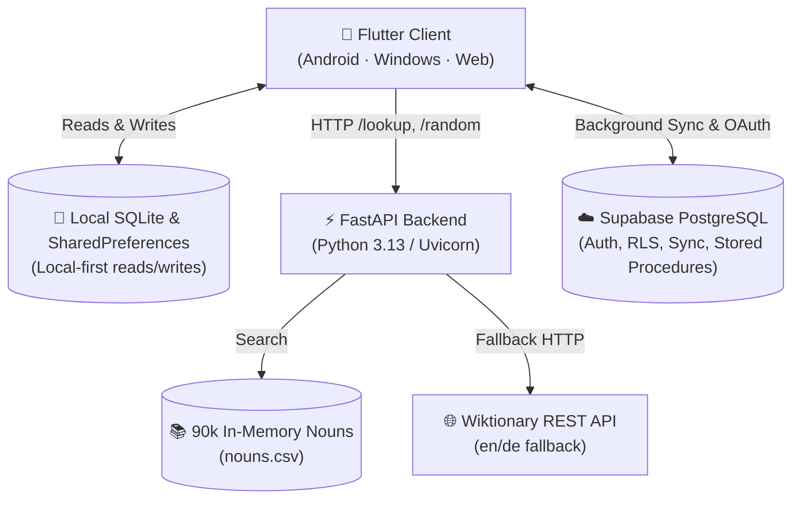
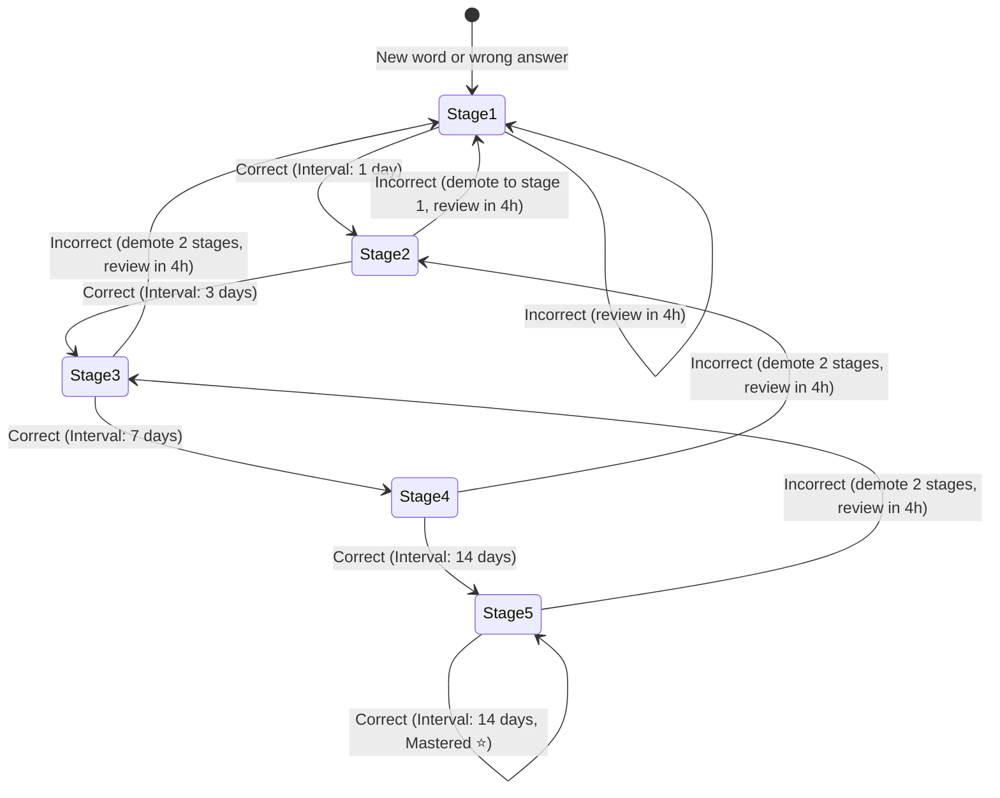
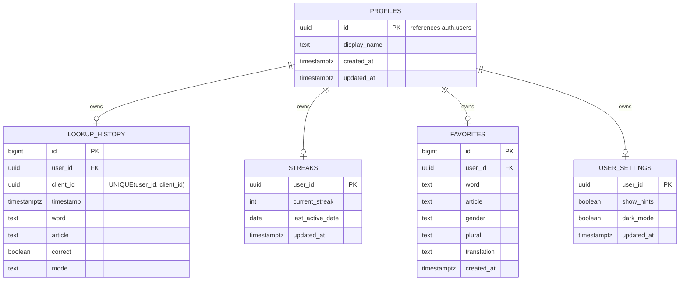

# 🇩🇪 Kapiert — Comprehensive Project Documentation

> **Kapiert** (*German: "got it"*) is a modern, cross-platform language learning application designed to help students master German noun genders (**der**, **die**, **das**) through instant lookups, drill quizzes, spaced repetition scheduling, streak tracking, and article mastery analytics.

---

## 📑 Table of Contents

1. [Executive Summary](#1-executive-summary)
2. [High-Level Architecture](#2-high-level-architecture)
3. [FastAPI Backend Service](#3-fastapi-backend-service)
   - [In-Memory Dataset Engine](#in-memory-dataset-engine)
   - [Wiktionary Fallback Pipeline](#wiktionary-fallback-pipeline)
   - [Balanced Quiz Distribution & Anti-Clumping](#balanced-quiz-distribution--anti-clumping)
   - [Example Sentences Generator & Multilingual Bank](#example-sentences-generator--multilingual-bank)
   - [API Endpoints Reference](#api-endpoints-reference)
4. [Flutter Client Application](#4-flutter-client-application)
   - [Clean Architecture & Directory Layout](#clean-architecture--directory-layout)
   - [State Management & Dependency Injection](#state-management--dependency-injection)
   - [Local-First Storage Engine](#local-first-storage-engine)
   - [Multilingual Localization & RTL Engine](#multilingual-localization--rtl-engine)
   - [Core Features & UI Modules](#core-features--ui-modules)
   - [Spaced Repetition System (SRS) Mechanics](#spaced-repetition-system-srs-mechanics)
   - [Weekly Activity Heatmap & Progress Trends](#weekly-activity-heatmap--progress-trends)
   - [Achievements & Gamification Milestones](#achievements--gamification-milestones)
5. [Supabase Cloud & Sync Architecture](#5-supabase-cloud--sync-architecture)
   - [Relational Database Schema](#relational-database-schema)
   - [Row Level Security (RLS) Policies](#row-level-security-rls-policies)
   - [Two-Way Synchronization Protocol](#two-way-synchronization-protocol)
   - [The `merge_streak` Stored Procedure](#the-merge_streak-stored-procedure)
6. [Design System & UI/UX](#6-design-system--uiux)
7. [Testing & Quality Assurance](#7-testing--quality-assurance)
8. [Setup & Deployment Guide](#8-setup--deployment-guide)

---

## 1. Executive Summary

In the German language, grammatical gender is notoriously arbitrary for learners: there is no universal grammatical rule to determine whether a noun is masculine (*der*), feminine (*die*), or neuter (*das*). Rote memorization often fails without structured reinforcement.

**Kapiert** solves this by combining:
1. **Instant, reliable lookup**: An offline in-memory dictionary of 90,927 German nouns with plural forms, transcription variant resolution (for foreign keyboards without umlauts/ß), and automatic fallback to Wiktionary.
2. **Interactive quiz drilling**: A 3-button tap quiz with balanced gender distribution and streak incentives.
3. **Spaced Repetition System (SRS)**: An expanding-interval Leitner scheduler (Stages 1–5) that automatically schedules review intervals (4h, 1d, 3d, 7d, 14d) based on answer accuracy.
4. **Deep analytics**: Mastery percentages broken down per article (*der*, *die*, *das*), automated weakest-article identification and recommendation, and SRS retention tracking.
5. **Universal accessibility**: Works 100% offline in Guest mode, with optional cross-device synchronization via Supabase.

---

## 2. High-Level Architecture

The project is structured into three decoupled layers:



### Key Principles
- **Local-First Reliability**: The Flutter app reads and writes from local SQLite and SharedPreferences. The app operates smoothly with zero latency and zero internet connection.
- **Microservice Separation**: The FastAPI backend handles word search and dictionary logic; Supabase handles authentication and persistent user data synchronization.
- **Deterministic Sync**: Network interruptions never cause data loss. Writes are queued locally and pushed idempotently using client-generated UUIDs.

---

## 3. FastAPI Backend Service

The backend source code is located in [`backend/`](file:///c:/Users/ASUS/Downloads/German_Articles/backend) and is entrypointed by [`backend/main.py`](file:///c:/Users/ASUS/Downloads/German_Articles/backend/main.py).

### In-Memory Dataset Engine
Implemented in [`backend/dataset.py`](file:///c:/Users/ASUS/Downloads/German_Articles/backend/dataset.py):
- **Startup Loading**: Reads [`nouns.csv`](file:///c:/Users/ASUS/Downloads/German_Articles/nouns.csv) (containing 90,927 lemmas with gender, plural, and grammar tags) into memory at application boot.
- **Normalization**: Strips punctuation, whitespace, and leading articles (`der`, `die`, `das`, `ein`, `eine`, `den`, `dem`, `des`, etc.).
- **Keyboard Transcription Variants**: Automatically maps ASCII substitutes from foreign keyboards:
  - `ae` $\rightarrow$ `ä` (e.g. *Maedchen* $\rightarrow$ *Mädchen*)
  - `oe` $\rightarrow$ `ö` (e.g. *Oel* $\rightarrow$ *Öl*)
  - `ue` $\rightarrow$ `ü` (e.g. *Uebung* $\rightarrow$ *Übung*)
  - `ss` $\rightarrow$ `ß` (e.g. *Strasse* $\rightarrow$ *Straße*, *Fuss* $\rightarrow$ *Fuß*)
- **Plural Reversal**: Maintains a reverse plural index. Entering a plural form (e.g., *Bücher*) automatically resolves to the base singular lemma (*das Buch*).
- **Compound Word Head Matcher**: In German, compound nouns take the gender of their final component (head noun). If a compound word like *Notizbuch* is missing, the algorithm scans suffixes to match the head lemma (*Buch* $\rightarrow$ *das*).

### Wiktionary Fallback Pipeline
Implemented in [`backend/wiktionary.py`](file:///c:/Users/ASUS/Downloads/German_Articles/backend/wiktionary.py):
- If a word is not found in the local dataset or compound matcher, the backend queries the English and German Wiktionary REST APIs using `httpx`.
- Extracts grammatical tags (`{{de-noun|...}}`), plural forms, and English translations.

### Balanced Quiz Distribution & Anti-Clumping
Implemented in [`backend/routes/random.py`](file:///c:/Users/ASUS/Downloads/German_Articles/backend/routes/random.py):
- Maintains pre-partitioned pools of nouns for each gender (`der`, `die`, `das`).
- `/random/batch/{count}` guarantees an exact 1:1:1 quota distribution among masculine, feminine, and neuter nouns.
- **Anti-clumping Algorithm**: Scans the generated list and swaps adjacent items to guarantee that no more than 2 consecutive nouns share the same article.

### Example Sentences Generator & Multilingual Bank
Implemented in [`backend/sentences.py`](file:///c:/Users/ASUS/Downloads/German_Articles/backend/sentences.py):
- **Curated Sentence Bank**: Rich bank of authentic, high-quality German example sentences with natural, idiomatic translations in English (`en`), Arabic (`ar`), and Turkish (`tr`) for high-frequency German nouns across all daily life categories (food, family, objects, places, animals, weather, feelings, abstract ideas).
- **Compound Noun Head Deconstruction**: Recognizes productive head suffixes (e.g. `*tasse`, `*glas`, `*suppe`, `*kuchen`, `*zimmer`, `*haus`, `*tür`, `*fenster`, `*buch`, `*schlüssel`, `*uhr`, `*auto`, `*zug`, `*tasche`, `*schule`, `*spiel`, etc.) and automatically embeds compound nouns into natural, semantically appropriate contexts.
- **Morphological Suffix Intelligence**: Matches grammatical noun suffixes (`-ung`, `-heit`, `-keit`, `-schaft`, `-ion`, `-tät`, `-er`, `-chen`, `-ment`) to appropriate abstract, qualitative, or collective sentence structures.
- **Communicative Learner Fallback**: Avoids nonsensical physical claims (e.g. "hier steht der schmerz") by using authentic German language-learning contexts that clearly demonstrate noun gender, case, and English translation if known.
- Returns a structured dictionary of translations for `en`, `ar`, and `tr`, enriched automatically on `/lookup/{word}` and `/random` endpoints.

### API Endpoints Reference

| Endpoint | Method | Response Model | Description |
|---|---|---|---|
| `/health` | `GET` | `HealthResponse` | Returns service status, version, and noun count loaded. |
| `/` | `GET` | `HealthResponse` | Root alias for Render and cloud health-checks. |
| `/lookup/{word}` | `GET` | `WordResponse` | Queries dataset $\rightarrow$ Wiktionary $\rightarrow$ compound head. |
| `/random` | `GET` | `WordResponse` | Returns a single random noun with equal 1/3 gender odds. |
| `/random/batch/{count}` | `GET` | `list[WordResponse]` | Returns up to 50 balanced, anti-clumped nouns for quizzes. |

#### Sample Response (`WordResponse`)
```json
{
  "word": "Buch",
  "article": "das",
  "gender": "n",
  "plural": "Bücher",
  "translation": "book",
  "example_sentence": "Das Buch liegt auf dem Tisch.",
  "example_translation": "The book is on the table.",
  "example_translations": {
    "en": "The book is on the table.",
    "ar": "الكتاب موجود على الطاولة.",
    "tr": "Kitap masanın üzerinde."
  },
  "source": "dataset",
  "found": true
}
```

---

## 4. Flutter Client Application

The mobile and desktop client lives in [`flutter_app/`](file:///c:/Users/ASUS/Downloads/German_Articles/flutter_app) and targets Android, Windows Desktop (via FFI SQLite), and Web.

### Clean Architecture & Directory Layout

```
flutter_app/lib/
├── config/              # AppConfig (URL resolution & build flags)
├── constants/           # Core constants
├── core/                # Infrastructure & Foundation
│   ├── di/              # Riverpod dependency injection registry (providers.dart)
│   ├── errors/          # Strongly typed Failure hierarchy (failures.dart)
│   ├── localization/    # AppLocalizations, AppLocalizationsDelegate, supported locales
│   ├── network/         # ApiClient (HTTP client wrapper)
│   ├── storage/         # StorageService (SQLite & SharedPreferences)
│   └── utils/           # UUID generator and helper utilities
├── data/                # Data Access Layer
│   ├── datasources/     # Remote & local datasources (Auth, Sync, Article)
│   ├── dto/             # Data Transfer Objects & JSON serialization
│   └── repositories/    # Concrete implementations of Domain repositories
├── domain/              # Business Domain (Pure Dart, Zero Framework Dependencies)
│   ├── models/          # WordModel, ExampleSentence, LocalSentenceProvider, LookupHistory, AuthUser, SrsItem, SrsStats
│   └── repositories/    # Abstract interfaces (IArticleRepository, ISrsRepository, etc.)
├── features/            # Presentation & Feature Slices
│   ├── auth/            # Sign-in, sign-up, email OTP, OAuth, Supabase setup sheet
│   ├── favorites/       # Word bookmarking & focused review quiz
│   ├── history/         # Chronological log, filter tabs, stats calculation
│   ├── legal/           # First-use consent gate, Terms of Use, Privacy Policy
│   ├── lookup/          # Instant search bar, article badges, result cards, sentence view
│   ├── profile/         # User profile, mastery breakdown, name editor, SRS metrics
│   ├── quiz/            # 3-button quiz trainer, streak progression, queue prefetch, sentence reveal
│   ├── settings/        # Theme toggle, language selector sheet, hints toggle, streak reset
│   ├── srs/             # Spaced Repetition providers and state
│   └── sync/            # Local-first background synchronization
└── shared/              # Shared Design System & UI
    ├── router/          # AppRouter & MainScaffold (4-tab localized bottom navigation)
    ├── theme/           # AppColors & AppTheme (Light & Dark mode)
    └── widgets/         # AppButton, AppTextField, AuthWidgets
```

### State Management & Dependency Injection
- Driven by **Riverpod 2.x**.
- All datasources and repositories are registered with interfaces in [`core/di/providers.dart`](file:///c:/Users/ASUS/Downloads/German_Articles/flutter_app/lib/core/di/providers.dart).
- Feature screens consume reactive `StateNotifier` and `Notifier` models (e.g., [`QuizNotifier`](file:///c:/Users/ASUS/Downloads/German_Articles/flutter_app/lib/features/quiz/providers/quiz_provider.dart), [`HistoryNotifier`](file:///c:/Users/ASUS/Downloads/German_Articles/flutter_app/lib/features/history/providers/history_provider.dart), [`SrsNotifier`](file:///c:/Users/ASUS/Downloads/German_Articles/flutter_app/lib/features/srs/providers/srs_provider.dart), [`SettingsNotifier`](file:///c:/Users/ASUS/Downloads/German_Articles/flutter_app/lib/features/settings/providers/settings_provider.dart)).

### Local-First Storage Engine
Implemented in [`StorageService`](file:///c:/Users/ASUS/Downloads/German_Articles/flutter_app/lib/core/storage/storage_service.dart):
- **Desktop FFI Support**: Automatically initializes `sqfliteFfiInit()` and `databaseFactoryFfi` when running on Windows, Linux, or macOS.
- **SQLite Database (`derdiedas.db`, schema version 6)**:
  - `history`: Log of lookups and quiz answers (`word`, `article`, `correct`, `mode`, `client_id`, `synced`, `timestamp`).
  - `favorites`: User-bookmarked words (`word`, `article`, `gender`, `plural`, `translation`, `created_at`).
  - `srs_items`: Spaced repetition state (`word`, `article`, `gender`, `stage`, `consecutive_correct`, `total_attempts`, `total_correct`, `last_reviewed`, `next_review`).
  - `achievements`: Unlocked and in-progress milestones (`id`, `title`, `description`, `category`, `icon_name`, `target_value`, `current_value`, `is_unlocked`, `unlocked_at`, `notified`).
  - `article_cache`: Offline article dictionary cache (`id`, `word`, `article`, `gender`, `plural`, `translation`, `source`, `examples`, `cached_at`) indexed by `LOWER(word)`.
- **SharedPreferences**: Stores light/dark theme preference, selected UI language (`en`, `ar`, `tr`, `de`), hints toggle, current streak count, sync timestamps, and push notification preferences (`notification_settings`: `enabled`, `hour`, `minute`, `streakAlerts`, `srsAlerts`).

### Core Features & UI Modules

#### 1. Instant Lookup ([`LookupScreen`](file:///c:/Users/ASUS/Downloads/German_Articles/flutter_app/lib/features/lookup/screens/lookup_screen.dart))
- Real-time search with clear buttons, instant submit, and localized input placeholders.
- Displays color-coded article badges, plural forms, gender labels, Wiktionary definitions, and contextual example sentences.
- Star button to toggle favorites directly from the result card.

#### 2. Quiz Trainer ([`QuizScreen`](file:///c:/Users/ASUS/Downloads/German_Articles/flutter_app/lib/features/quiz/screens/quiz_screen.dart))
- Three large, tactile buttons: **der** (blue), **die** (red), **das** (green).
- Immediate color and haptic feedback on selection.
- Reveals example sentences with active UI language translations upon answer submission.
- Streak progression counter (🔥) with animated accuracy progress bar.
- Offline fallback pool of 60 balanced nouns ensures the quiz functions without network connectivity.

#### 3. Lookup & Quiz History ([`HistoryScreen`](file:///c:/Users/ASUS/Downloads/German_Articles/flutter_app/lib/features/history/screens/history_screen.dart))
- Filter tabs: `All`, `Correct`, `Incorrect`, `Quiz`, and `Lookup`.
- Displays timestamps, full nouns with gender colors, and outcome checkmarks.

#### 4. Favorites & Focused Review ([`FavoritesProvider`](file:///c:/Users/ASUS/Downloads/German_Articles/flutter_app/lib/features/favorites/providers/favorites_provider.dart))
- Star words to create a custom study list.
- Tapping **`Review (X)`** initiates a dedicated quiz session restricted to favorited vocabulary.

#### 5. User Profile & Article Mastery ([`ProfileScreen`](file:///c:/Users/ASUS/Downloads/German_Articles/flutter_app/lib/features/profile/screens/profile_screen.dart))
- **Article Mastery Card**: Calculates individual accuracy percentages for *der*, *die*, and *das*.
- **Weakest Article Recommendation**: When at least 5 quiz attempts have been made on an article and accuracy is $<90\%$, displays an alert:
  > 💡 **Focus on [article]** — it's your lowest quiz accuracy.
- **Display Name Editor & Avatar**: Editable display name with custom initials avatar and sign-in method badges.

#### 6. In-App Legal Gate ([`FirstUseConsentScreen`](file:///c:/Users/ASUS/Downloads/German_Articles/flutter_app/lib/features/legal/screens/first_use_consent_screen.dart))
- Gated first-use modal requiring agreement to Terms of Use and Privacy Policy before accessing the app.
- Full markdown viewers for [TERMS_OF_USE.md](file:///c:/Users/ASUS/Downloads/German_Articles/TERMS_OF_USE.md) and [PRIVACY_POLICY.md](file:///c:/Users/ASUS/Downloads/German_Articles/PRIVACY_POLICY.md).

#### 7. Example Sentences with Multilingual Translation
Implemented across [`ExampleSentence`](file:///c:/Users/ASUS/Downloads/German_Articles/flutter_app/lib/domain/models/example_sentence.dart), [`LocalSentenceProvider`](file:///c:/Users/ASUS/Downloads/German_Articles/flutter_app/lib/domain/models/local_sentence_provider.dart), and [`_ExampleSentenceView`](file:///c:/Users/ASUS/Downloads/German_Articles/flutter_app/lib/features/lookup/screens/result_card.dart):
- **Domain Representation**: Encapsulates the German sentence and dynamic translation mapping (`Map<String, String>`).
- **Result Card Presentation**:
  - Highlights German example in an accent card container with italic quotation styling.
  - Automatically translates the sentence into the user's active UI language (`en`, `ar`, `tr`, or `de`).
  - Includes a quick-copy icon button with animated clipboard confirmation.
- **Quiz Feedback Reveal**: Contextual reinforcement after each quiz answer displays the example sentence and translated meaning before proceeding to the next noun.
- **Offline Guarantee & Semantic Intelligence**: When API responses do not contain sentences, `LocalSentenceProvider` mirrors the backend engine with an extensive curated bank (over 250 nouns), compound head matching across common suffixes, morphological derivations (`-ung`, `-heit`, `-keit`, `-chen`, `-lein`), and communicative language learning fallbacks that eliminate nonsensical generated sentences.

#### 8. Multilingual Localization & RTL System
Implemented in [`AppLocalizations`](file:///c:/Users/ASUS/Downloads/German_Articles/flutter_app/lib/core/localization/app_localizations.dart) and [`SettingsNotifier`](file:///c:/Users/ASUS/Downloads/German_Articles/flutter_app/lib/features/settings/providers/settings_provider.dart):
- **Supported Locales**:
  - 🇬🇧 English (`en`) — International baseline locale.
  - 🇸🇦 Arabic (`ar`) — Complete Right-to-Left (RTL) layout switching, directional navigation, and Arabic typography.
  - 🇹🇷 Turkish (`tr`) — Full Turkish locale coverage.
  - 🇩🇪 German (`de`) — Native German interface strings.
- **End-to-End Screen Coverage**: Zero hardcoded English strings remaining across the app:
  - **Lookup & Result Cards**: "Check Article" action, loading indicators, localized gender badges (*maskulin*, *feminin*, *neutral*), word source badges, and sentence copy tooltips.
  - **Quiz Mode**: Quiz headers, instructions, answer feedback banners, next word actions, SRS scheduled review badges, milestone unlock alerts, session completion, and error states.
  - **History Screen**: History titles, aggregate count labels, accuracy metric labels, filter chips (*All*, *Correct*, *Incorrect*, *Favorites*), focused review prompts, empty state explanations, and word action chips.
  - **Settings**: Section group headers, preferences, dark mode, server status, clear history dialog, streak reset, password change, legal document links, consent status, and data source citations.
  - **Auth & Session**: Modal logout confirmation dialog with localized titles, blur backdrop, cancel, and confirmed log out buttons.
  - **Profile & Progress**: User header badges, guest state indicators, cloud sync status, progress section headings, article mastery analytics, weakest-article advice, spaced repetition retention metrics, milestone preview cards, gallery sheets, and weekly activity heatmap controls.
- **Synchronous First-Frame Delegate**: `AppLocalizationsDelegate` resolves strings synchronously using `SynchronousFuture` to eliminate async microtask delay during widget bootstrapping and golden frame rendering.
- **Scrollable Modal Bottom Sheet**: Language selection sheet in Settings uses bounded scroll physics and high-contrast active checkmarks, eliminating any RenderFlex bottom overflow on compact devices.
- **Global Reactive Propagation**: Riverpod `localeProvider` drives instant UI layout and string re-rendering across navigation bars, headers, cards, dialogs, and snackbars without restarting the application.

#### 9. Daily Practice Reminders & Push Notifications
Implemented across [`NotificationSettings`](file:///c:/Users/ASUS/Downloads/German_Articles/flutter_app/lib/domain/models/notification_settings.dart), [`NotificationService`](file:///c:/Users/ASUS/Downloads/German_Articles/flutter_app/lib/core/notifications/notification_service.dart), [`NotificationNotifier`](file:///c:/Users/ASUS/Downloads/German_Articles/flutter_app/lib/features/notifications/providers/notification_provider.dart), and [`NotificationSettingsSheet`](file:///c:/Users/ASUS/Downloads/German_Articles/flutter_app/lib/features/notifications/widgets/notification_settings_sheet.dart):
- **Cross-Platform Scheduling Engine**: Backed by `flutter_local_notifications` 22.x and `timezone`. Features automated initialization with platform guards (Android notification channel `derdiedas_daily_reminders`, Darwin settings, Linux actions) that safely adapt to any desktop or test environment without unhandled native plugin crashes.
- **Customizable Daily Reminders**: Users can configure reminder times via an interactive Flutter `TimeOfDay` time picker with immediate `zonedSchedule` daily repeating synchronization.
- **Streak Saver & SRS Review Due Alerts**: Granular toggles to enable or disable evening streak protection nudges and notifications when spaced repetition cards become due for review.
- **Interactive Verification**: Includes an instant "Send Test Notification" action directly within Settings with floating SnackBar confirmation.
- **Zero-Friction Persistence**: All user preferences persist locally in SharedPreferences and restore automatically on application reboot.
- **Full Localization**: Completely localized across English, German, Arabic (RTL), and Turkish.

#### 10. Full Offline Mode & Local Article Cache
Implemented across [`ArticleLocalDS`](file:///c:/Users/ASUS/Downloads/German_Articles/flutter_app/lib/data/datasources/article_local_ds.dart), [`ArticleRepositoryImpl`](file:///c:/Users/ASUS/Downloads/German_Articles/flutter_app/lib/data/repositories/article_repository_impl.dart), and [`OfflineCacheSheet`](file:///c:/Users/ASUS/Downloads/German_Articles/flutter_app/lib/features/settings/widgets/offline_cache_sheet.dart):
- **Local-First SQLite Article Cache**: Backed by SQLite table `article_cache` (schema version 6) with case-insensitive `LOWER(word)` indexing.
- **Transparent Offline Fallback Pipeline**: `ArticleRepositoryImpl` implements remote-first lookup with automated background caching. Upon network failure, timeout, or server unavailability, queries automatically and transparently resolve from local cache without throwing uncaught UI exceptions.
- **Pre-Seeded Core Vocabulary**: Bundles 100+ high-frequency A1–B1 German nouns with definitive articles, genders, plural forms, multilingual translations (`en`, `ar`, `tr`), and contextual example sentences. Available immediately even on clean app installs before any network requests are performed.
- **Smart Query Normalization & Compound Matcher**: Strips leading definite/indefinite articles (`der`, `die`, `das`, `ein`, `eine`), cleans punctuation, resolves umlaut/transcription variants (`ae`/`ä`, `oe`/`ö`, `ue`/`ü`, `ss`/`ß`), and performs suffix head analysis on German compound nouns to inherit base gender.
- **Visual Offline Badging**: When an article is served offline, `ResultCard` displays a distinctive green offline badge with an `Icons.offline_pin_rounded` icon and localized label.
- **Cache Management Dashboard**: In Settings -> Data -> Offline Article Cache, users can inspect stored word counts, pre-seed vocabulary on demand, and clear local cache.

---

### Spaced Repetition System (SRS) Mechanics

The Spaced Repetition System schedules noun practice using an expanding Leitner interval algorithm:



#### Stages & Interval Schedule

| Stage | Name | Interval | Criteria |
|---|---|---|---|
| **1** | **Learning** | **4 hours** | Newly introduced or recently failed word |
| **2** | **Review** | **1 day** | 1 correct quiz answer |
| **3** | **Familiar** | **3 days** | 2 consecutive correct answers |
| **4** | **Solid** | **7 days** | 3 consecutive correct answers |
| **5** | **Mastered** 🌟 | **14 days** | 4+ consecutive correct answers |

#### Scheduling Features
1. **Automatic Interleaving**: In standard quiz mode, [`QuizNotifier._fetchSmartBatch()`](file:///c:/Users/ASUS/Downloads/German_Articles/flutter_app/lib/features/quiz/providers/quiz_provider.dart) queries overdue words (`nextReview <= now`) and queues them at the head of the question queue, followed by fresh vocabulary.
2. **Dedicated SRS Review Mode**: When due words are available, a **`Due (X)`** chip appears in the Quiz header. Tapping it starts an isolated session on due cards with an exit control.
3. **Completion Celebration**: Once all due words are practiced, an automated celebratory view confirms the learner is caught up.
4. **Card Feedback**: Each question displays its current stage tag; answering renders a feedback banner with the updated stage and next scheduled review date.
5. **Profile Metrics**: The Profile Screen displays aggregate counts for **Due now**, **Learning**, **Reviewing**, **Mastered**, and an overall retention mastery bar.

---

### Weekly Activity Heatmap & Progress Trends

To provide learners with visual feedback on consistency and habit formation, Kapiert tracks daily learning actions across rolling multi-day windows (default 14 days, displayed in a 7-day weekly view).

#### 1. Activity Domain Models
- [`DailyActivity`](file:///c:/Users/ASUS/Downloads/German_Articles/flutter_app/lib/domain/models/daily_activity.dart): Aggregates daily lookup and quiz metrics (`totalCount`, `quizCount`, `quizCorrect`, `lookupCount`, `uniqueWords`, `accuracy`). Calculates intensity level `0–4` based on action thresholds:
  - Level 0: 0 actions (unfilled / subtle background)
  - Level 1: 1–4 actions (light tint)
  - Level 2: 5–9 actions (moderate tint)
  - Level 3: 10–19 actions (vibrant tint)
  - Level 4: 20+ actions (high intensity primary glow)
- [`AdvancedStats`](file:///c:/Users/ASUS/Downloads/German_Articles/flutter_app/lib/domain/models/advanced_stats.dart): Computes week-over-week trends, active day count (out of 7), daily average actions, overall accuracy rate, and identifies the learner's peak practice day (`bestDayCount`, `bestDayDate`).

#### 2. Local Aggregation Engine
Implemented in [`StorageService.getAdvancedStats()`](file:///c:/Users/ASUS/Downloads/German_Articles/flutter_app/lib/core/storage/storage_service.dart):
- Queries SQLite `history` with SQL date aggregation:
  ```sql
  SELECT
    strftime('%Y-%m-%d', timestamp) as day_str,
    COUNT(*) as total_count,
    SUM(CASE WHEN mode = 'quiz' THEN 1 ELSE 0 END) as quiz_count,
    SUM(CASE WHEN mode = 'quiz' AND correct = 1 THEN 1 ELSE 0 END) as quiz_correct,
    SUM(CASE WHEN mode = 'lookup' THEN 1 ELSE 0 END) as lookup_count,
    COUNT(DISTINCT word) as unique_words
  FROM history
  WHERE timestamp >= ?
  GROUP BY day_str
  ORDER BY day_str ASC
  ```
- Fills missing calendar days with zero-count `DailyActivity` instances so that every day in the rolling window is represented continuously.

#### 3. Interactive Visualization Cards
- [`AdvancedStatsCard`](file:///c:/Users/ASUS/Downloads/German_Articles/flutter_app/lib/features/profile/widgets/advanced_stats_card.dart):
  - **7-Day Activity Heatmap Grid**: Rendered with smooth rounded cells colored by intensity level. Displays weekday initial (`M`, `D`, `M`, `D`, `F`, `S`, `S`) and day numbers.
  - **Interactive Day Inspector Pill**: Tapping any day cell highlights it with a focused outline and reveals an animated inspection badge displaying exact counts (e.g. `12 actions · 10 quiz (80%) · 2 lookups · 9 words`).
  - **Daily Practice Volume Bar Chart**: An animated vertical bar chart displaying proportional volume per day with a baseline bar for rest days.
  - **Key Metrics Grid**: Displays 7-Day Total volume, Week-over-Week trend badge (`+15% vs last week`), Daily Average, and Best Day record.

---

### Achievements & Gamification Milestones

Kapiert features a gamification engine designed to reward learner consistency, vocabulary acquisition volume, quiz accuracy, SRS mastery, and curation.

#### 1. Milestone Categories & Badges
Achievements are modeled in [`Achievement`](file:///c:/Users/ASUS/Downloads/German_Articles/flutter_app/lib/domain/models/achievement.dart) across 5 distinct categories:

| Category | Icon | Predefined Milestones |
|---|---|---|
| **Streak** (`streak`) | 🔥 | First Step (1d), Three's a Charm (3d), Flame Keeper (7d), Two-Week Titan (14d), Month of Mastery (30d) |
| **Vocabulary** (`vocabulary`) | 📚 | Word Novice (10 words), Vocabulary Builder (25 words), Half-Century (50 words), Century Club (100 words), Master of Lexicon (250 words), Word Titan (500 words) |
| **Quiz Mastery** (`mastery`) | 🎯 | Quiz Debut (10 quiz answers), Quiz Enthusiast (50 answers), Century Quizzer (100 answers), Grand Quizmaster (250 answers), Sharpshooter (10 consecutive quiz answers with $\ge 90\%$ accuracy) |
| **Spaced Repetition** (`srs`) | 🃏 | First Retention (5 words to SRS Stage 5), Memory Master (20 words to SRS Stage 5) |
| **Favorites** (`favorites`) | ⭐ | Curator (5 bookmarked favorites), Lexicon Collector (25 bookmarked favorites) |

#### 2. Evaluation & Unnotified Unlock Detection
Implemented in [`StorageService.getAchievements()`](file:///c:/Users/ASUS/Downloads/German_Articles/flutter_app/lib/core/storage/storage_service.dart) and [`AchievementsRepositoryImpl`](file:///c:/Users/ASUS/Downloads/German_Articles/flutter_app/lib/data/repositories/achievements_repository_impl.dart):
- Reads active streak from `SharedPreferences`, unique words, quiz answer count, and accuracy from SQLite `history`, SRS mastery counts from `srs_items`, and total bookmarked count from `favorites`.
- Cross-references current metrics against target thresholds.
- When an achievement threshold is crossed for the first time, it is committed to SQLite `achievements` table with `is_unlocked = 1`, current UTC timestamp, and `notified = 0`.
- Calling `checkNewUnlocks()` queries unnotified unlocks, returns them for in-app celebration, and marks them `notified = 1`.

#### 3. Real-Time In-Quiz Celebration & Modal Gallery
- **Live Celebration Pill**: When an answer during a quiz session unlocks an achievement, [`QuizScreen`](file:///c:/Users/ASUS/Downloads/German_Articles/flutter_app/lib/features/quiz/screens/quiz_screen.dart) displays an animated achievement banner with a glowing trophy icon and milestone title:
  > 🏆 **Milestone Unlocked!** [Achievement Title]
- **Profile Summary Card** ([`AchievementsCard`](file:///c:/Users/ASUS/Downloads/German_Articles/flutter_app/lib/features/profile/widgets/achievements_card.dart)): Shows overall progress bar (e.g. `7 of 19 badges earned (37%)`), preview badge tiles with subtle glow effects for unlocked badges, and category filter chips.
- **Milestone Detail Sheet** ([`MilestoneDetailSheet`](file:///c:/Users/ASUS/Downloads/German_Articles/flutter_app/lib/features/profile/widgets/milestone_detail_sheet.dart)): Full-screen modal gallery displaying all 19 achievements, unlocked timestamps, progress bars for in-progress items, and category tabs (`All`, `Streaks`, `Vocabulary`, `Quiz`, `SRS`, `Favorites`).

---

## 5. Supabase Cloud & Sync Architecture

Supabase provides cloud authentication, database persistence, and cross-device synchronization. Migration scripts are maintained in [`supabase/migrations/`](file:///c:/Users/ASUS/Downloads/German_Articles/supabase/migrations).

### Relational Database Schema



### Row Level Security (RLS) Policies
Every table enforces Postgres Row Level Security (`alter table ... enable row level security`):
- `SELECT`, `INSERT`, `UPDATE`, `DELETE` policies enforce `auth.uid() = user_id`.
- Defaults are set to `auth.uid()` on insert to prevent accidental spoofing.

### Two-Way Synchronization Protocol
Managed by [`SyncNotifier`](file:///c:/Users/ASUS/Downloads/German_Articles/flutter_app/lib/features/sync/providers/sync_provider.dart):
1. **Local-First Writes**: When offline or in guest mode, entries write instantly to SQLite with `synced = 0`.
2. **Pushes**: When online and signed in, unpushed rows are batched to Supabase. Client UUIDs (`client_id`) ensure idempotent upserts. On success, SQLite rows are marked `synced = 1`.
3. **Pulls**: Queries records where `id > last_pulled_cursor` to fetch new data from other devices.
4. **Guest Migration**: Upon first sign-in, any local guest history is automatically merged into the user's cloud account.
5. **Sign-out Safety**: Before logging out, pending local changes are flushed to the cloud before local account data is cleared.

### The `merge_streak` Stored Procedure
Defined in [`20261004000000_cloud_sync.sql`](file:///c:/Users/ASUS/Downloads/German_Articles/supabase/migrations/20261004000000_cloud_sync.sql):
- Solves multi-device streak sync where two devices were used on different days or offline.
- Calculates contiguous day intervals $[L - N + 1, L]$. If device and server runs overlap or touch, it creates their mathematical union; otherwise, the newest active date wins without overwriting longer streaks with zeros.

---

## 6. Design System & UI/UX

Implemented in [`AppColors`](file:///c:/Users/ASUS/Downloads/German_Articles/flutter_app/lib/shared/theme/app_colors.dart) and [`AppTheme`](file:///c:/Users/ASUS/Downloads/German_Articles/flutter_app/lib/shared/theme/app_theme.dart):

### Color Palette
- 🔵 **Der (Masculine)**: `#1A5CAA` (Light) / `#3B82F6` (Dark)
- 🔴 **Die (Feminine)**: `#C02626` (Light) / `#EF4444` (Dark)
- 🟢 **Das (Neuter)**: `#2D7A3A` (Light) / `#22C55E` (Dark)
- 🟠 **Streak / Due Alert**: `#F97316` / `#FB923C`
- 🟡 **Favorites / Mastered**: `#FFB800`
- ⚪/⚫ **Surfaces**: Curated neutral slate/zinc layers (`#F8F9FA` light / `#161822` dark) with border-defined contrast.

### Typography & Polish
- Google Font **Nunito** for rounded, friendly, high-legibility German characters with umlauts and uppercase nouns.
- Smooth transitions and micro-animations via `flutter_animate`.
- Scrollable constrained wrappers ensure zero layout overflows regardless of screen aspect ratio or on-screen keyboards.

---

## 7. Testing & Quality Assurance

Both the backend and Flutter applications maintain comprehensive automated test suites.

### Test Execution Commands

```bash
# 1. Backend API Tests (13 tests)
cd backend
python -m pytest tests/ -v

# 2. Flutter Unit, Widget & Integration Tests (111 tests)
cd flutter_app
flutter test

# 3. Flutter Static Analysis (0 issues)
flutter analyze
```

### Coverage Overview

| Test Suite | File | Tests | Validates |
|---|---|---|---|
| **API Contract & Sentences** | [`backend/tests/test_api.py`](file:///c:/Users/ASUS/Downloads/German_Articles/backend/tests/test_api.py) | 13 | Query normalization, exact lookup, plural lookup, umlaut variants, Wiktionary fallback, random batch balance, anti-clumping, and multilingual example sentences (`de`, `en`, `ar`, `tr`). |
| **Localization Engine** | [`flutter_app/test/core/localization/app_localizations_test.dart`](file:///c:/Users/ASUS/Downloads/German_Articles/flutter_app/test/core/localization/app_localizations_test.dart) | 6 | All 4 locales (`en`, `ar`, `tr`, `de`), RTL directionality detection, translation fallbacks, delegate resolution, and dynamic parameterized helper methods. |
| **Sentence Domain Models** | [`flutter_app/test/domain/models/example_sentence_test.dart`](file:///c:/Users/ASUS/Downloads/German_Articles/flutter_app/test/domain/models/example_sentence_test.dart) | 5 | Translation retrieval by language code, fallback order, JSON serialization/deserialization, and offline sentence provider. |
| **Network Client** | [`flutter_app/test/core/network/api_client_test.dart`](file:///c:/Users/ASUS/Downloads/German_Articles/flutter_app/test/core/network/api_client_test.dart) | 4 | HTTP GET parsing, timeout handling, error mapping. |
| **Word Models** | [`flutter_app/test/domain/models/word_model_test.dart`](file:///c:/Users/ASUS/Downloads/German_Articles/flutter_app/test/domain/models/word_model_test.dart) | 7 | Equality, JSON conversion, gender labels, backward-compatible sentence serialization. |
| **Result Card & Sentences** | [`flutter_app/test/features/lookup/screens/result_card_test.dart`](file:///c:/Users/ASUS/Downloads/German_Articles/flutter_app/test/features/lookup/screens/result_card_test.dart) | 2 | Article badge, German word, translation, example sentence rendering with active locale translation, clipboard copy, and offline cache badge. |
| **Settings & Bottom Sheets** | [`flutter_app/test/features/settings/screens/settings_screen_test.dart`](file:///c:/Users/ASUS/Downloads/German_Articles/flutter_app/test/features/settings/screens/settings_screen_test.dart) | 5 | Language tile, 4-language bottom sheet, Arabic RTL dynamic update, notifications sheet opening, and offline cache sheet opening. |
| **Notification Settings Model** | [`flutter_app/test/domain/models/notification_settings_test.dart`](file:///c:/Users/ASUS/Downloads/German_Articles/flutter_app/test/domain/models/notification_settings_test.dart) | 5 | Default values, TimeOfDay reminderTime conversion, copyWith updates, symmetric JSON serialization, equality, and hash code. |
| **Notification Scheduler** | [`flutter_app/test/features/notifications/providers/notification_provider_test.dart`](file:///c:/Users/ASUS/Downloads/German_Articles/flutter_app/test/features/notifications/providers/notification_provider_test.dart) | 7 | State initialization, toggling daily reminders, permission requests, zonedSchedule daily reminders, cancel schedules, time picker updates, streak/SRS switches, and instant test notification. |
| **Notification Settings Widget** | [`flutter_app/test/features/notifications/widgets/notification_settings_sheet_test.dart`](file:///c:/Users/ASUS/Downloads/German_Articles/flutter_app/test/features/notifications/widgets/notification_settings_sheet_test.dart) | 3 | Modal bottom sheet header, master switch toggle, revealed reminder controls, time picker trigger, and test notification button with confirmation SnackBar. |
| **Article Local Data Source** | [`flutter_app/test/data/datasources/article_local_ds_test.dart`](file:///c:/Users/ASUS/Downloads/German_Articles/flutter_app/test/data/datasources/article_local_ds_test.dart) | 10 | Leading article query normalization (`der`, `die`, `das`, `ein`, `eine`), punctuation cleanup, case-insensitivity, masculine/feminine/neuter core lookups, compound noun head suffix analysis, random word batching, and unknown word fallbacks. |
| **Article Repository Fallback** | [`flutter_app/test/data/repositories/article_repository_impl_test.dart`](file:///c:/Users/ASUS/Downloads/German_Articles/flutter_app/test/data/repositories/article_repository_impl_test.dart) | 8 | Remote-first lookup with auto-caching, transparent offline fallback to local SQLite cache on network failure, error rethrow when absent, random/randomBatch offline fallbacks, and health checks. |
| **Offline Cache Sheet Widget** | [`flutter_app/test/features/settings/widgets/offline_cache_sheet_test.dart`](file:///c:/Users/ASUS/Downloads/German_Articles/flutter_app/test/features/settings/widgets/offline_cache_sheet_test.dart) | 3 | Stored article count metric display, pre-seed essential vocabulary button invocation with feedback SnackBar, and clear offline cache button with confirmation. |
| **Daily Activity Model** | [`flutter_app/test/domain/models/daily_activity_test.dart`](file:///c:/Users/ASUS/Downloads/German_Articles/flutter_app/test/domain/models/daily_activity_test.dart) | 3 | Intensity levels 0–4 thresholds, accuracy calculation, model immutability. |
| **Advanced Stats Model** | [`flutter_app/test/domain/models/advanced_stats_test.dart`](file:///c:/Users/ASUS/Downloads/German_Articles/flutter_app/test/domain/models/advanced_stats_test.dart) | 4 | Aggregation logic, week-over-week trends, rolling slice computations, best day tracking. |
| **Achievements Model** | [`flutter_app/test/domain/models/achievement_test.dart`](file:///c:/Users/ASUS/Downloads/German_Articles/flutter_app/test/domain/models/achievement_test.dart) | 3 | Categories, unlock status, progress percentage, copyWith behavior. |
| **SRS Domain Model** | [`flutter_app/test/domain/models/srs_item_test.dart`](file:///c:/Users/ASUS/Downloads/German_Articles/flutter_app/test/domain/models/srs_item_test.dart) | 6 | Stages 1–5 advancement, incorrect answer regression, interval durations, `isDue` logic, SQLite serialization. |
| **SRS Scheduling** | [`flutter_app/test/features/quiz/srs_scheduling_test.dart`](file:///c:/Users/ASUS/Downloads/German_Articles/flutter_app/test/features/quiz/srs_scheduling_test.dart) | 3 | Smart batch prioritization of due words, review mode entry/exit, session completion. |
| **SRS Quiz Widgets** | [`flutter_app/test/features/quiz/srs_quiz_widget_test.dart`](file:///c:/Users/ASUS/Downloads/German_Articles/flutter_app/test/features/quiz/srs_quiz_widget_test.dart) | 2 | Due chip rendering, mode banner toggle, feedback badge with review scheduling and sentence reveal. |
| **SRS Profile Stats** | [`flutter_app/test/features/profile/srs_profile_test.dart`](file:///c:/Users/ASUS/Downloads/German_Articles/flutter_app/test/features/profile/srs_profile_test.dart) | 1 | Spaced repetition section rendering, retention metric tiles, mastery bar. |
| **Advanced Stats Widget** | [`flutter_app/test/features/profile/advanced_stats_widget_test.dart`](file:///c:/Users/ASUS/Downloads/German_Articles/flutter_app/test/features/profile/advanced_stats_widget_test.dart) | 2 | 7-day activity heatmap grid, interactive day inspector pill, volume bar chart, key metric tiles. |
| **Achievements Widget** | [`flutter_app/test/features/profile/achievements_widget_test.dart`](file:///c:/Users/ASUS/Downloads/German_Articles/flutter_app/test/features/profile/achievements_widget_test.dart) | 1 | Milestones summary card, badge previews, modal gallery sheet invocation. |
| **Quiz Core** | [`flutter_app/test/features/quiz/quiz_randomization_test.dart`](file:///c:/Users/ASUS/Downloads/German_Articles/flutter_app/test/features/quiz/quiz_randomization_test.dart) | 4 | Word deduplication, anti-clumping, offline fallback pool. |
| **Profile & Mastery** | [`flutter_app/test/features/profile/profile_screen_test.dart`](file:///c:/Users/ASUS/Downloads/German_Articles/flutter_app/test/features/profile/profile_screen_test.dart) | 3 | Guest vs signed-in states, article mastery bars, weakest article recommendation. |
| **Favorites** | [`flutter_app/test/features/favorites/favorites_widget_test.dart`](file:///c:/Users/ASUS/Downloads/German_Articles/flutter_app/test/features/favorites/favorites_widget_test.dart) | 5 | Star toggling, history favorites tab, focused review quiz. |
| **Legal Consent Gate** | [`flutter_app/test/features/legal/app_first_use_gate_test.dart`](file:///c:/Users/ASUS/Downloads/German_Articles/flutter_app/test/features/legal/app_first_use_gate_test.dart) | 5 | First-launch lock, legal document markdown viewers, unlock upon acceptance. |
| **Auth & Verification** | [`flutter_app/test/features/auth/verify_email_screen_test.dart`](file:///c:/Users/ASUS/Downloads/German_Articles/flutter_app/test/features/auth/verify_email_screen_test.dart) | 7 | OTP inputs, pasting 6-digit codes, validation errors. |

---

## 8. Setup & Deployment Guide

### 1. Running the FastAPI Backend

#### Via Docker Compose
```bash
docker compose up -d
# Server available at http://127.0.0.1:8000
```

#### Via Local Python
```bash
cd backend
pip install -r requirements.txt
python main.py
```

### 2. Running the Flutter App

```bash
cd flutter_app
flutter pub get

# Windows Desktop (connects to local backend at 127.0.0.1:8000)
flutter run -d windows

# Chrome (Web)
flutter run -d chrome

# Android Emulator (connects to 10.0.2.2:8000)
flutter run
```

#### Connecting to Supabase Cloud
Provide build parameters via `--dart-define` or use the in-app **`Setup Supabase`** sheet:
```bash
flutter run \
  --dart-define=API_BASE_URL=https://your-backend.onrender.com \
  --dart-define=SUPABASE_URL=https://your-project.supabase.co \
  --dart-define=SUPABASE_ANON_KEY=eyJhbGciOi...
```

### 3. Deploying to Render
The repository includes [`render.yaml`](file:///c:/Users/ASUS/Downloads/German_Articles/render.yaml):
1. Connect the repository at [dashboard.render.com](https://dashboard.render.com).
2. Render reads `render.yaml`, downloads `nouns.csv`, installs dependencies, and launches `uvicorn main:app`.
3. Use the deployed URL as `API_BASE_URL` in Flutter builds.
